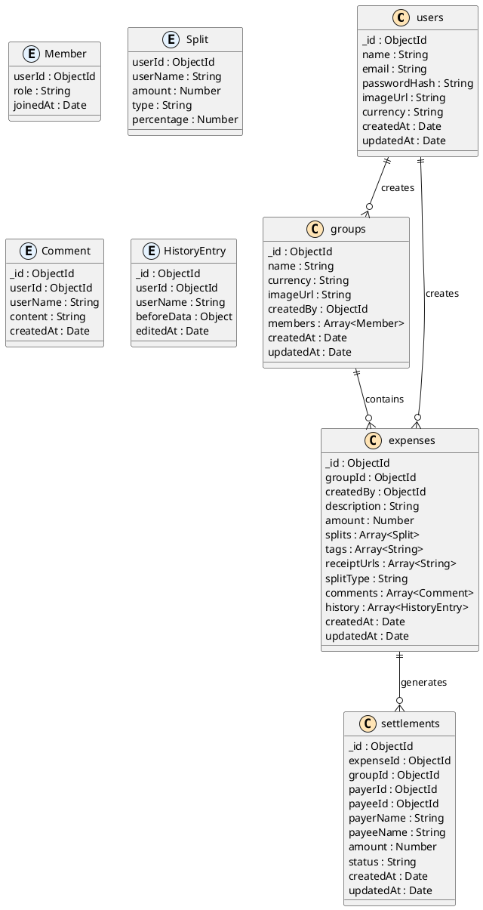

# Database Schema for Splitwiser (MongoDB)

## Overview

This document outlines the database schema for Splitwiser, a modern expense splitting application using MongoDB. The schema is designed to support core functionalities including user management, group-based expense tracking, flexible expense splitting, and settlement management.

## Key Design Principles

- **ObjectId Primary Keys**: All collections use MongoDB ObjectId for primary keys to ensure global uniqueness and optimal performance
- **Audit Trail**: All documents include `createdAt` and `updatedAt` timestamps for tracking changes
- **Embedded Documents**: Leverage MongoDB's document structure for complex nested data like expense splits and metadata
- **Flexible Schema**: Take advantage of MongoDB's schema flexibility while maintaining data consistency through application-level validation
- **Denormalization**: Strategic denormalization for frequently accessed data to optimize read performance

## Document Relationship Diagram



## Collection Definitions

### 1. users Collection

The `users` collection stores all user account information and authentication data.

```javascript
{
  _id: ObjectId,
  name: String,              // User's full name
  email: String,             // Unique email address (indexed)
  passwordHash: String,      // Hashed password using bcrypt
  imageUrl: String,          // Profile picture URL (optional)
  currency: String,          // Preferred currency (ISO 4217, default: "USD")
  createdAt: Date,          // Account creation timestamp
  updatedAt: Date           // Last profile update timestamp
}
```

**Validation Rules:**
```javascript
{
  name: { required: true, minLength: 1, maxLength: 100 },
  email: { required: true, unique: true, format: "email" },
  passwordHash: { required: true },
  currency: { default: "USD", enum: ["USD", "EUR", "GBP", "INR", ...] }
}
```

**Indexes:**
```javascript
db.users.createIndex({ email: 1 }, { unique: true })
db.users.createIndex({ createdAt: 1 })
```

### 2. groups Collection

The `groups` collection represents expense sharing groups with embedded member information.

```javascript
{
  _id: ObjectId,
  name: String,              // Group name/title
  currency: String,          // Default currency for group expenses
  imageUrl: String,          // Group picture/avatar URL (optional)
  createdBy: ObjectId,       // Reference to users._id
  members: [                 // Embedded member documents
    {
      userId: ObjectId,      // Reference to users._id
      role: String,          // "admin" | "member"
      joinedAt: Date         // When user joined the group
    }
  ],
  createdAt: Date,
  updatedAt: Date
}
```

**Validation Rules:**
```javascript
{
  name: { required: true, minLength: 1, maxLength: 100 },
  currency: { required: true, default: "USD" },
  createdBy: { required: true, type: "ObjectId" },
  "members.$.role": { enum: ["admin", "member"], default: "member" }
}
```

**Indexes:**
```javascript
db.groups.createIndex({ createdBy: 1 })
db.groups.createIndex({ "members.userId": 1 })
db.groups.createIndex({ createdAt: 1 })
```

### 3. expenses Collection

Core collection storing all expense information with embedded splits, comments, and history.

```javascript
{
  _id: ObjectId,
  groupId: ObjectId,         // Reference to groups._id
  createdBy: ObjectId,       // Reference to users._id
  description: String,       // Expense description
  amount: Number,            // Total expense amount (Decimal128 for precision)
  splits: [                  // How the expense is split
    {
      userId: ObjectId,      // Reference to users._id
      userName: String,      // Denormalized for quick access
      amount: Number,        // Amount this user owes
      type: String,          // "equal" | "exact" | "percentage"
      percentage: Number     // If type is "percentage"
    }
  ],
  tags: [String],           // Expense tags/categories
  receiptUrls: [String],    // Receipt image URLs
  splitType: String,        // "equal" | "exact" | "percentage" | "custom"
  comments: [               // Embedded comments
    {
      _id: ObjectId,
      userId: ObjectId,
      userName: String,      // Denormalized
      content: String,
      createdAt: Date
    }
  ],
  history: [                // Embedded edit history
    {
      _id: ObjectId,
      userId: ObjectId,
      userName: String,      // Denormalized
      beforeData: Object,    // Snapshot before edit
      editedAt: Date
    }
  ],
  createdAt: Date,
  updatedAt: Date
}
```

**Validation Rules:**
```javascript
{
  groupId: { required: true, type: "ObjectId" },
  createdBy: { required: true, type: "ObjectId" },
  description: { required: true, minLength: 1, maxLength: 500 },
  amount: { required: true, min: 0.01 },
  splitType: { enum: ["equal", "exact", "percentage", "custom"] },
  "splits.$.amount": { min: 0 },
  "splits.$.type": { enum: ["equal", "exact", "percentage"] }
}
```

**Indexes:**
```javascript
db.expenses.createIndex({ groupId: 1, createdAt: -1 })
db.expenses.createIndex({ createdBy: 1 })
db.expenses.createIndex({ "splits.userId": 1 })
db.expenses.createIndex({ tags: 1 })
db.expenses.createIndex({ createdAt: -1 })
```

### 4. settlements Collection

Tracks debt settlements between users, can be used for both calculated debts and actual payments.

```javascript
{
  _id: ObjectId,
  expenseId: ObjectId,       // Reference to expenses._id (optional for manual settlements)
  groupId: ObjectId,         // Reference to groups._id
  payerId: ObjectId,         // Reference to users._id (who owes money)
  payeeId: ObjectId,         // Reference to users._id (who is owed money)
  payerName: String,         // Denormalized for quick access
  payeeName: String,         // Denormalized for quick access
  amount: Number,            // Settlement amount
  status: String,            // "pending" | "completed" | "cancelled"
  description: String,       // Optional description for manual settlements
  createdAt: Date,
  updatedAt: Date
}
```

**Validation Rules:**
```javascript
{
  groupId: { required: true, type: "ObjectId" },
  payerId: { required: true, type: "ObjectId" },
  payeeId: { required: true, type: "ObjectId" },
  amount: { required: true, min: 0.01 },
  status: { enum: ["pending", "completed", "cancelled"], default: "pending" }
}
```

**Indexes:**
```javascript
db.settlements.createIndex({ expenseId: 1 })
db.settlements.createIndex({ groupId: 1 })
db.settlements.createIndex({ payerId: 1, status: 1 })
db.settlements.createIndex({ payeeId: 1, status: 1 })
db.settlements.createIndex({ createdAt: -1 })
```

## MongoDB-Specific Design Patterns

### 1. Embedding vs Referencing Strategy

**Embedded Documents (Used for):**
- Group members in `groups` collection
- Expense splits, comments, and history in `expenses` collection
- Small, bounded data that's frequently accessed together

**References (Used for):**
- User references across collections
- Group references in expenses and settlements
- Large or frequently updated independent entities

### 2. Denormalization for Performance

Strategic denormalization is used to reduce join operations:
- User names embedded in splits, comments, and settlements
- This trades some storage space for significant read performance gains
- Update operations must maintain consistency across denormalized data

### 3. Document Size Considerations

- `expenses` documents may grow with comments and history
- MongoDB document size limit is 16MB, which should be sufficient
- If growth becomes an issue, consider moving history to a separate collection

## Indexes and Performance Optimization

### Essential Indexes

```javascript
// Users collection
db.users.createIndex({ email: 1 }, { unique: true })
db.users.createIndex({ createdAt: 1 })

// Groups collection  
db.groups.createIndex({ createdBy: 1 })
db.groups.createIndex({ "members.userId": 1 })
db.groups.createIndex({ createdAt: 1 })

// Expenses collection
db.expenses.createIndex({ groupId: 1, createdAt: -1 })
db.expenses.createIndex({ createdBy: 1 })
db.expenses.createIndex({ "splits.userId": 1 })
db.expenses.createIndex({ tags: 1 })
db.expenses.createIndex({ createdAt: -1 })

// Settlements collection
db.settlements.createIndex({ expenseId: 1 })
db.settlements.createIndex({ groupId: 1 })
db.settlements.createIndex({ payerId: 1, status: 1 })
db.settlements.createIndex({ payeeId: 1, status: 1 })
db.settlements.createIndex({ createdAt: -1 })

// Compound indexes for common queries
db.expenses.createIndex({ groupId: 1, "splits.userId": 1 })
db.settlements.createIndex({ groupId: 1, payerId: 1, payeeId: 1 })
```

### Text Search Indexes

```javascript
// Enable text search on expense descriptions and comments
db.expenses.createIndex({
  description: "text",
  "comments.content": "text",
  tags: "text"
})
```

## Data Validation with MongoDB Schema Validation

```javascript
// Example validation for expenses collection
db.createCollection("expenses", {
  validator: {
    $jsonSchema: {
      bsonType: "object",
      required: ["groupId", "createdBy", "description", "amount", "splits"],
      properties: {
        groupId: { bsonType: "objectId" },
        createdBy: { bsonType: "objectId" },
        description: { 
          bsonType: "string", 
          minLength: 1, 
          maxLength: 500 
        },
        amount: { 
          bsonType: "number", 
          minimum: 0.01 
        },
        splits: {
          bsonType: "array",
          minItems: 1,
          items: {
            bsonType: "object",
            required: ["userId", "amount"],
            properties: {
              userId: { bsonType: "objectId" },
              amount: { bsonType: "number", minimum: 0 },
              type: { 
                enum: ["equal", "exact", "percentage"] 
              }
            }
          }
        },
        splitType: { 
          enum: ["equal", "exact", "percentage", "custom"] 
        }
      }
    }
  }
})
```

## Query Patterns and Examples

### Common Queries

```javascript
// Get all groups for a user
db.groups.find({ "members.userId": ObjectId("user_id") })

// Get all expenses for a group, sorted by date
db.expenses.find({ groupId: ObjectId("group_id") })
  .sort({ createdAt: -1 })

// Get user's balance in a group
db.expenses.aggregate([
  { $match: { groupId: ObjectId("group_id") } },
  { $unwind: "$splits" },
  { $match: { "splits.userId": ObjectId("user_id") } },
  { $group: { 
    _id: null, 
    totalOwed: { $sum: "$splits.amount" },
    totalPaid: { $sum: { $cond: [
      { $eq: ["$createdBy", ObjectId("user_id")] },
      "$amount",
      0
    ]}}
  }}
])

// Get settlements between two users
db.settlements.find({
  $or: [
    { payerId: ObjectId("user1"), payeeId: ObjectId("user2") },
    { payerId: ObjectId("user2"), payeeId: ObjectId("user1") }
  ],
  status: "pending"
})
```

## Scalability and Performance Considerations

### 1. Sharding Strategy
- **Shard Key**: `groupId` for expenses and settlements
- Groups expenses and related data on the same shard
- Enables efficient queries within groups

### 2. Read Preferences
- Use secondary reads for balance calculations and reporting
- Primary reads for critical operations like expense creation

### 3. Connection Pooling
- Configure appropriate connection pool sizes
- Use connection string options for optimal performance

### 4. Aggregation Pipeline Optimization
- Use `$match` early in pipelines to reduce document processing
- Create indexes that support aggregation operations
- Consider using `$lookup` sparingly due to performance impact

### 5. Data Archiving Strategy
- Archive old settled expenses to separate collections
- Implement time-based partitioning for historical data
- Use MongoDB's Time Series Collections for audit logs if needed

## Security Considerations

### 1. Field-Level Security
- Hash passwords using bcrypt with appropriate salt rounds
- Never store plain text passwords or sensitive financial data

### 2. Data Access Patterns
- Implement proper authorization checks in application layer
- Users should only access groups they're members of
- Validate user permissions for expense modifications

### 3. Connection Security
- Use TLS/SSL for all database connections
- Implement proper authentication mechanisms
- Use connection string encryption for sensitive credentials