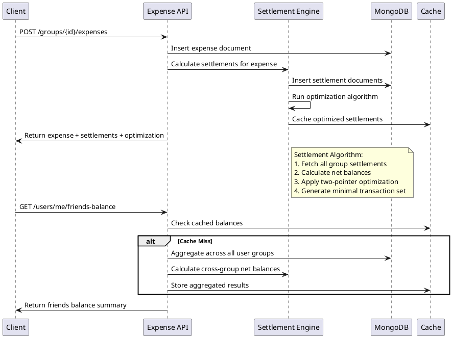

# Expense Service API Documentation

## API Endpoint Summary

| Method | Endpoint                                        | Description                                                                 |
|--------|-------------------------------------------------|-----------------------------------------------------------------------------|
| POST   | [/groups/{group_id}/expenses](#create-expense)  | Creates a new expense within a group.                                       |
| GET    | [/groups/{group_id}/expenses](#list-group-expenses) | Lists all expenses for a group.                                             |
| GET    | [/groups/{group_id}/expenses/{expense_id}](#get-single-expense) | Retrieves details for a single expense.                                     |
| PATCH  | [/groups/{group_id}/expenses/{expense_id}](#update-expense) | Updates an existing expense.                                                |
| DELETE | [/groups/{group_id}/expenses/{expense_id}](#delete-expense) | Deletes an expense.                                                         |
| POST   | [/groups/{group_id}/expenses/{expense_id}/attachments](#upload-attachment-for-an-expense) | Upload attachment for an expense.                                           |
| GET    | [/groups/{group_id}/expenses/{expense_id}/attachments/{key}](#getdownload-an-attachment) | Get/download an attachment.                                                 |
| POST   | [/groups/{group_id}/settlements](#manually-record-payment)             | Manually record a payment settlement between users in a group.              |
| GET    | [/groups/{group_id}/settlements](#get-group-settlements) | Retrieves pending and optimized settlements for a group.                  |
| GET    | [/groups/{group_id}/settlements/{settlement_id}](#get-single-settlement) | Retrieves details for a single settlement.                                |
| PATCH  | [/groups/{group_id}/settlements/{settlement_id}](#mark-settlement-as-paid) | Marks a settlement as paid.                                               |
| DELETE | [/groups/{group_id}/settlements/{settlement_id}](#deleteundo-settlement) | Deletes/undoes a recorded settlement.                                       |
| POST   | [/groups/{group_id}/settlements/optimize](#calculate-optimized-settlements) | Calculates and returns optimized (simplified) settlements for a group.    |
| GET    | [/users/me/friends-balance](#get-cross-group-friend-balances) | Retrieves the current user's aggregated balances with all friends.        |
| GET    | [/users/me/balance-summary](#get-overall-user-balance-summary) | Retrieves an overall balance summary for the current user.                  |
| GET    | [/groups/{group_id}/users/{user_id}/balance](#get-user-balance-in-specific-group) | Gets a specific user's balance within a particular group.               |
| GET    | [/groups/{group_id}/analytics](#group-expense-analytics) | Provides expense analytics for a group.                                     |

## Overview

The Expense Service, a core component detailed in the [Micro-plan](./micro-plan.md#4-expense-management-service) and [Settlement Service section](./micro-plan.md#5-settlement-service), manages expense creation, splitting, and settlement calculations for Splitwiser. It handles the core business logic of expense tracking and debt settlement optimization using a directed graph algorithm. This service interacts closely with the [Group Service](./group-service.md) for managing expenses within groups and relies on the [Auth Service](./auth-service.md) for user authentication and authorization. The underlying data structures are defined in the [Non-Relational Database Schema](./nonrelational-database-schema.md).

## Key Features

- **Expense Management**: Create, read, update, delete expenses
- **Smart Settlement**: Automatic settlement calculation with debt minimization algorithm
- **Friends Balance Aggregation**: Cross-group balance summary for users
- **Real-time Updates**: Immediate settlement calculations after expense operations

## Core Algorithm: Settlement Simplification

The service uses a directed graph algorithm to minimize transactions:

1. **Calculate Net Balance**: For each user, compute `net_balance = total_paid - total_owed`
2. **Separate Debtors/Creditors**: Sort users by net balance (negative = debtor, positive = creditor)
3. **Two-Pointer Optimization**: Match highest debtor with highest creditor iteratively
4. **Minimize Transactions**: Reduce number of settlements to minimum required

```plantuml
@startuml SettlementAlgorithm
!define debtor(x) class x << (D,#FFB6C1) >>
!define creditor(x) class x << (C,#90EE90) >>

package "Settlement Calculation" {
  debtor(UserA) : owes $150
  debtor(UserB) : owes $50
  creditor(UserC) : owed $100
  creditor(UserD) : owed $100
  
  UserA --> UserC : $100
  UserA --> UserD : $50
  UserB --> UserD : $50
}

note right : Algorithm reduces 6 potential\ntransactions to 3 optimal ones
@enduml
```

## API Endpoints

### 1. Expense CRUD Operations

#### Create Expense

```http
POST /groups/{group_id}/expenses
Authorization: Bearer <access_token>
Content-Type: application/json

{
  "description": "Dinner at Restaurant XYZ",
  "amount": 500.00,
  "splits": [
    {
      "userId": "user_a_id",
      "amount": 125.00,
      "type": "equal"
    },
    {
      "userId": "user_b_id", 
      "amount": 125.00,
      "type": "equal"
    },
    {
      "userId": "user_c_id",
      "amount": 125.00,
      "type": "equal"
    },
    {
      "userId": "user_d_id",
      "amount": 125.00,
      "type": "equal"
    }
  ],
  "splitType": "equal",
  "tags": ["dinner", "restaurant"],
  "receiptUrls": ["https://storage.example.com/receipt123.jpg"]
}
```

**Response:**
```json
{
  "expense": {
    "_id": "65f1a2b3c4d5e6f7a8b9c0d1",
    "groupId": "65f1a2b3c4d5e6f7a8b9c0d0",
    "createdBy": "user_a_id",
    "description": "Dinner at Restaurant XYZ",
    "amount": 500.00,
    "splits": [...],
    "tags": ["dinner", "restaurant"],
    "receiptUrls": [...],
    "createdAt": "2024-01-15T18:30:00Z",
    "updatedAt": "2024-01-15T18:30:00Z"
  },
  "settlements": [
    {
      "_id": "65f1a2b3c4d5e6f7a8b9c0d2",
      "expenseId": "65f1a2b3c4d5e6f7a8b9c0d1",
      "groupId": "65f1a2b3c4d5e6f7a8b9c0d0",
      "payerId": "user_a_id",
      "payeeId": "user_a_id",
      "payerName": "Alice",
      "payeeName": "Alice",
      "amount": 125.00,
      "status": "completed",
      "createdAt": "2024-01-15T18:30:00Z"
    },
    {
      "_id": "65f1a2b3c4d5e6f7a8b9c0d3",
      "expenseId": "65f1a2b3c4d5e6f7a8b9c0d1",
      "groupId": "65f1a2b3c4d5e6f7a8b9c0d0",
      "payerId": "user_a_id",
      "payeeId": "user_b_id",
      "payerName": "Alice",
      "payeeName": "Bob",
      "amount": 125.00,
      "status": "pending",
      "createdAt": "2024-01-15T18:30:00Z"
    }
    // ... similar entries for user_c and user_d
  ],
  "groupSummary": {
    "totalExpenses": 2750.00,
    "totalSettlements": 12,
    "optimizedSettlements": [
      {
        "fromUserId": "user_b_id",
        "toUserId": "user_a_id",
        "amount": 125.00,
        "fromUserName": "Bob",
        "toUserName": "Alice"
      }
      // ... optimized settlement suggestions
    ]
  }
}
```

#### List Group Expenses

```http
GET /groups/{group_id}/expenses?page=1&limit=20&from=2024-01-01&to=2024-12-31&tags=dinner,travel
Authorization: Bearer <access_token>
```

**Response:**
```json
{
  "expenses": [
    {
      "_id": "...",
      "description": "...",
      "amount": 500.00,
      "createdBy": "...",
      "createdAt": "...",
      "splits": [...],
      "tags": [...]
    }
  ],
  "pagination": {
    "page": 1,
    "limit": 20,
    "total": 157,
    "totalPages": 8,
    "hasNext": true,
    "hasPrev": false
  },
  "summary": {
    "totalAmount": 15750.00,
    "expenseCount": 157,
    "avgExpense": 100.32
  }
}
```

#### Get Single Expense

```http
GET /groups/{group_id}/expenses/{expense_id}
Authorization: Bearer <access_token>
```

**Response:**
```json
{
  "expense": {
    "_id": "...",
    "groupId": "...",
    "description": "Dinner at Restaurant XYZ",
    "amount": 500.00,
    "splits": [...],
    "comments": [
      {
        "_id": "...",
        "userId": "...",
        "userName": "Bob",
        "content": "Great dinner! Thanks for organizing.",
        "createdAt": "2024-01-15T19:00:00Z"
      }
    ],
    "history": [
      {
        "_id": "...",
        "userId": "...",
        "userName": "Alice",
        "beforeData": {
          "amount": 450.00,
          "description": "Dinner at Restaurant"
        },
        "editedAt": "2024-01-15T18:45:00Z"
      }
    ],
    "createdAt": "...",
    "updatedAt": "..."
  },
  "relatedSettlements": [...]
}
```

#### Update Expense

```http
PATCH /groups/{group_id}/expenses/{expense_id}
Authorization: Bearer <access_token>
Content-Type: application/json

{
  "description": "Updated dinner description",
  "amount": 550.00,
  "splits": [
    {
      "userId": "user_a_id",
      "amount": 137.50,
      "type": "equal"
    }
    // ... updated splits
  ]
}
```

#### Delete Expense

```http
DELETE /groups/{group_id}/expenses/{expense_id}
Authorization: Bearer <access_token>
```

**Response (200 OK):**
```json
{
  "success": true
}
```

### Attachment Handling

Endpoints for managing expense attachments (e.g., receipts).

#### Upload Attachment for an Expense

```http
POST /groups/{group_id}/expenses/{expense_id}/attachments
Authorization: Bearer <access_token>
Content-Type: multipart/form-data

<File Data>
```

**Response (201 Created):**
```json
{
  "attachment_key": "unique_attachment_key_string",
  "url": "https://storage.example.com/attachments/unique_attachment_key_string.jpg"
}
```

#### Get/Download an Attachment

```http
GET /groups/{group_id}/expenses/{expense_id}/attachments/{key}
Authorization: Bearer <access_token>
```

**Response (200 OK):**

Returns the file stream.

### 2. Settlement Management

#### Manually Record Payment

Allows users to manually record a payment made outside the system or a direct settlement.

```http
POST /groups/{group_id}/settlements
Authorization: Bearer <access_token>
Content-Type: application/json

{
  "payer_id": "user_who_paid_id",
  "payee_id": "user_who_received_id",
  "amount": 25.50,
  "description": "Settled for lunch last week",
  "paidAt": "2024-01-17T14:00:00Z"
}
```

**Response (201 Created):**
```json
{
  "settlement": {
    "id": "settlement_abc789",
    "group_id": "group_xyz123",
    "payer_id": "user_who_paid_id",
    "payee_id": "user_who_received_id",
    "amount": 25.50,
    "status": "completed", // Or "pending_confirmation" if an approval flow is added
    "description": "Settled for lunch last week",
    "paidAt": "2024-01-17T14:00:00Z",
    "recordedAt": "2024-01-17T14:05:00Z"
  }
}
```

#### Get Group Settlements

```http
GET /groups/{group_id}/settlements?status=pending&page=1&limit=50
Authorization: Bearer <access_token>
```

**Response:**
```json
{
  "settlements": [
    {
      "_id": "...",
      "expenseId": "...",
      "payerId": "...",
      "payeeId": "...",
      "payerName": "Bob",
      "payeeName": "Alice", 
      "amount": 125.00,
      "status": "pending",
      "description": "Share for dinner",
      "createdAt": "..."
    }
  ],
  "optimizedSettlements": [
    {
      "fromUserId": "user_b_id",
      "toUserId": "user_a_id",
      "amount": 250.00,
      "fromUserName": "Bob",
      "toUserName": "Alice",
      "consolidatedExpenses": [
        "expense_id_1",
        "expense_id_2"
      ]
    }
  ],
  "summary": {
    "totalPending": 750.00,
    "transactionCount": 15,
    "optimizedCount": 3
  },
  "pagination": {
    "currentPage": 1,
    "totalPages": 3,
    "totalItems": 75,
    "limit": 25
  }
}
```

#### Get Single Settlement

Retrieves details for a specific settlement record.

```http
GET /groups/{group_id}/settlements/{settlement_id}
Authorization: Bearer <access_token>
```

**Response (200 OK):**
```json
{
  "settlement": {
    "id": "settlement_abc789",
    "group_id": "group_xyz123",
    "payer_id": "user_who_paid_id",
    "payee_id": "user_who_received_id",
    "amount": 25.50,
    "status": "completed",
    "description": "Settled for lunch last week",
    "paidAt": "2024-01-17T14:00:00Z",
    "recordedAt": "2024-01-17T14:05:00Z",
    "related_expense_id": "exp_def456" // Optional, if linked to an expense
  }
}
```

#### Mark Settlement as Paid

```http
PATCH /groups/{group_id}/settlements/{settlement_id}
Authorization: Bearer <access_token>
Content-Type: application/json

{
  "status": "completed",
  "paidAt": "2024-01-16T10:30:00Z"
}
```

**Response (200 OK):**
```json
{
  "settlement": {
    // ... updated settlement object ...
    "status": "completed",
    "paidAt": "2024-01-16T10:30:00Z"
  }
}
```

#### Delete/Undo Settlement

Removes or marks a settlement as void. Useful for correcting mistakes.

```http
DELETE /groups/{group_id}/settlements/{settlement_id}
Authorization: Bearer <access_token>
```

**Response (200 OK):**
```json
{
  "success": true,
  "message": "Settlement record deleted successfully."
}
```

#### Calculate Optimized Settlements

```http
POST /groups/{group_id}/settlements/optimize
Authorization: Bearer <access_token>
```

**Response:**
```json
{
  "optimizedSettlements": [
    {
      "fromUserId": "user_b_id",
      "toUserId": "user_a_id",
      "amount": 175.00,
      "description": "Consolidated debt",
      "affectedExpenses": ["exp_1", "exp_2", "exp_3"]
    }
  ],
  "savings": {
    "originalTransactions": 12,
    "optimizedTransactions": 3,
    "reductionPercentage": 75
  }
}
```

### 3. Friends Balance Aggregation

#### Get Cross-Group Friend Balances

```http
GET /users/me/friends-balance
Authorization: Bearer <access_token>
```

**Response:**
```json
{
  "friendsBalance": [
    {
      "userId": "user_b_id",
      "userName": "Bob",
      "userImageUrl": "https://...",
      "netBalance": 2.00,
      "owesYou": true,
      "breakdown": [
        {
          "groupId": "group_1_id",
          "groupName": "Weekend Trip",
          "balance": 4.00,
          "owesYou": true
        },
        {
          "groupId": "group_2_id", 
          "groupName": "Office Lunch",
          "balance": -2.00,
          "owesYou": false
        }
      ],
      "lastActivity": "2024-01-15T18:30:00Z"
    },
    {
      "userId": "user_c_id",
      "userName": "Charlie",
      "userImageUrl": "https://...",
      "netBalance": 4.00,
      "owesYou": true,
      "breakdown": [
        {
          "groupId": "group_1_id",
          "groupName": "Weekend Trip", 
          "balance": 4.00,
          "owesYou": true
        }
      ],
      "lastActivity": "2024-01-14T12:15:00Z"
    },
    {
      "userId": "user_d_id",
      "userName": "David",
      "userImageUrl": "https://...",
      "netBalance": -1.00,
      "owesYou": false,
      "breakdown": [
        {
          "groupId": "group_2_id",
          "groupName": "Office Lunch",
          "balance": -1.00,
          "owesYou": false
        }
      ],
      "lastActivity": "2024-01-13T09:45:00Z"
    }
  ],
  "summary": {
    "totalOwedToYou": 6.00,
    "totalYouOwe": 1.00,
    "netBalance": 5.00,
    "friendCount": 3,
    "activeGroups": 2
  }
}
```

#### Get Overall User Balance Summary

Retrieves an overall financial summary for the currently authenticated user across all their activities.

```http
GET /users/me/balance-summary
Authorization: Bearer <access_token>
```

**Response (200 OK):**
```json
{
  "totalOwedToYou": 120.50,
  "totalYouOwe": 75.25,
  "netBalance": 45.25, // Positive: net amount others owe to user
  "currency": "USD", // Assuming a primary currency or conversion for summary
  "groupsSummary": [
    {
      "group_id": "group_abc123",
      "group_name": "Weekend Trip",
      "yourBalanceInGroup": 20.00 // Positive: you are owed in this group
    },
    {
      "group_id": "group_def456",
      "group_name": "Monthly Bills",
      "yourBalanceInGroup": -15.50 // Negative: you owe in this group
    }
  ]
}
```

#### Get User Balance in Specific Group

```http
GET /groups/{group_id}/users/{user_id}/balance
Authorization: Bearer <access_token>
```

**Response:**
```json
{
  "userBalance": {
    "userId": "user_b_id",
    "userName": "Bob",
    "totalPaid": 450.00,
    "totalOwed": 375.00,
    "netBalance": 75.00,
    "owesYou": true,
    "pendingSettlements": [
      {
        "settlementId": "...",
        "amount": 25.00,
        "expenseDescription": "Lunch yesterday",
        "createdAt": "..."
      }
    ],
    "recentExpenses": [
      {
        "expenseId": "...",
        "description": "Coffee",
        "userShare": 12.50,
        "createdAt": "..."
      }
    ]
  }
}
```

### 4. Analytics and Reporting

#### Group Expense Analytics

```http
GET /groups/{group_id}/analytics?period=month&year=2024&month=1
Authorization: Bearer <access_token>
```

**Response:**
```json
{
  "analytics": {
    "period": "2024-01",
    "totalExpenses": 2750.00,
    "expenseCount": 23,
    "avgExpenseAmount": 119.57,
    "topCategories": [
      {
        "tag": "food",
        "amount": 1200.00,
        "count": 12,
        "percentage": 43.6
      },
      {
        "tag": "transport", 
        "amount": 800.00,
        "count": 6,
        "percentage": 29.1
      }
    ],
    "memberContributions": [
      {
        "userId": "user_a_id",
        "userName": "Alice",
        "totalPaid": 1100.00,
        "totalOwed": 687.50,
        "netContribution": 412.50
      }
    ],
    "expenseTrends": [
      {
        "date": "2024-01-01",
        "amount": 125.00,
        "count": 2
      }
      // ... daily aggregations
    ]
  }
}
```

## Service Architecture Flow



## Data Models Alignment

Based on the [Non-Relational Database Schema](./nonrelational-database-schema.md), here's how the API maps to collections:

### Expense Creation Flow:
1. **Insert into [`expenses` collection](./nonrelational-database-schema.md#3-expenses-collection)**: Main expense document with embedded splits
2. **Insert into [`settlements` collection](./nonrelational-database-schema.md#4-settlements-collection)**: Individual settlement records for debt tracking
3. **Update group statistics**: Cached aggregations for performance (potentially in [`groups` collection](./nonrelational-database-schema.md#2-groups-collection) or a dedicated analytics store)

### Settlement Optimization:
1. **Query [`settlements` collection](./nonrelational-database-schema.md#4-settlements-collection) by groupId**: Get all pending settlements
2. **Calculate net balances**: Aggregate by user pairs
3. **Apply graph algorithm**: Minimize transaction count
4. **Return optimized structure**: Suggested payments

## Error Handling

```http
400 Bad Request - Invalid expense data
401 Unauthorized - Invalid or expired token
403 Forbidden - Not a group member
404 Not Found - Group or expense not found
409 Conflict - Expense already exists or settlement mismatch
422 Unprocessable Entity - Validation errors (splits don't sum to total)
500 Internal Server Error - Server processing error
```

## Rate Limiting

- **Expense Creation**: 10 requests/minute per user
- **Settlement Calculations**: 5 requests/minute per group
- **Friends Balance**: 20 requests/minute per user
- **Analytics**: 30 requests/minute per user

## Caching Strategy

- **Group Balances**: Cache for 5 minutes, invalidate on new expense
- **Friends Aggregation**: Cache for 10 minutes, invalidate on settlement update
- **Optimized Settlements**: Cache for 15 minutes per group
- **Analytics**: Cache for 1 hour, refresh daily for historical data
