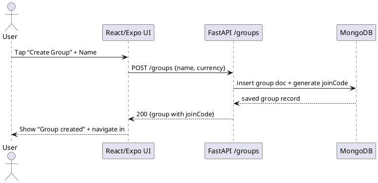
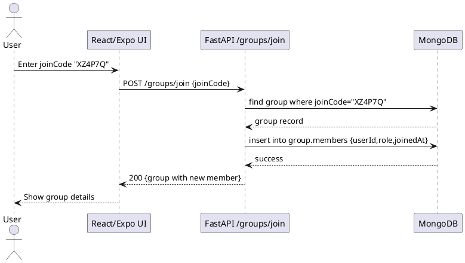

# Group Service API Documentation
# =========================

## 1. Create a New Group

1. **Client**

   * User taps “New Group”
   * Enters `{ name, currency?, image_url? }`

2. **API Call**

   ```http
   POST /groups
   Authorization: Bearer <access_token>
   Content-Type: application/json

   {
     "name": "Weekend Trip",
     "currency": "INR"
   }
   ```

3. **Server**

   * Generates a new `group_id`
   * Persists document in MongoDB (`groups` collection)
   * Generates a **joinCode** (e.g. short, 6-char alphanumeric) mapped to `group_id`
   * Responds with full group object

4. **Response**

   ```json
   200 OK
   {
     "group": {
       "id": "642f1e4a9b3c2d1f6a1b2c3d",
       "name": "Weekend Trip",
       "currency": "INR",
       "joinCode": "XZ4P7Q",
       "createdBy": "user123",
       "createdAt": "...",
       "imageUrl": null
     }
   }
   ```

5. **Client**

   * Shows “Group created!”
   * Navigates into the group’s dashboard



---

## 2. Invite & Join by Code (or QR/URL)

### a) Generating an Invite Code/URL

* **Invite Code**: the `joinCode` field we already generated on creation.
* **Invite URL**: e.g. `https://app.splitwiser.com/join/XZ4P7Q` (mobile OS will deep-link into your Expo app).

### b) Joining via Code

1. **Client**

   * User enters code `XZ4P7Q` (or scans QR that embeds it)

2. **API Call**

   ```http
   POST /groups/join
   Authorization: Bearer <access_token>
   Content-Type: application/json

   { "joinCode": "XZ4P7Q" }
   ```

3. **Server**

   * Looks up the `groups` collection for `joinCode = "XZ4P7Q"`
   * If found & user not already a member:

     * Add a new `member` sub-doc in the group: `{ userId, role: "member", joinedAt }`
   * Returns the updated group

4. **Response**

   ```json
   200 OK
   {
     "group": {
       "id": "...",
       "name": "Weekend Trip",
       "members": [
         { "userId": "user123", "role": "admin" },
         { "userId": "user456", "role": "member" }
       ],
       ...
     }
   }
   ```



---

## 3. Prevent Leaving Before Settlement

* **Endpoint**

  ```http
  POST   /groups/{group_id}/leave
  Authorization: Bearer <access_token>
  ```

* **Server Logic**

  1. Before removing the user from `group.members`, run a check against:

     * Outstanding balances (`/groups/{group_id}/analytics/summary?userId=<me>`)
     * Active unsettled expenses or settlements
  2. If **zero** balance: remove member and return `200`.
  3. If **non-zero**: return `400 Bad Request` with:

     ```json
     { "error": "You have unsettled balances of ₹123.45" }
     ```

---

## 4. CRUD Endpoints Recap

| Method | Path                                     | Description                         |
| :----: | ---------------------------------------- | ----------------------------------- |
|  POST  | `/groups`                                | Create group                        |
|   GET  | `/groups`                                | List groups current user belongs to |
|   GET  | `/groups/{group_id}`                     | Get group details (incl. members)   |
|  PATCH | `/groups/{group_id}`                     | Update group metadata               |
| DELETE | `/groups/{group_id}`                     | Delete group (admin only)           |
|  POST  | `/groups/join`                           | Join by `joinCode`                  |
|  POST  | `/groups/{group_id}/leave`               | Leave group (if settled)            |
|   GET  | `/groups/{group_id}/members`             | List members                        |
|  PATCH | `/groups/{group_id}/members/{member_id}` | Change role (admin/member)          |
| DELETE | `/groups/{group_id}/members/{member_id}` | Remove a member (admin only)        |

*All require `Authorization: Bearer <token>`.*
