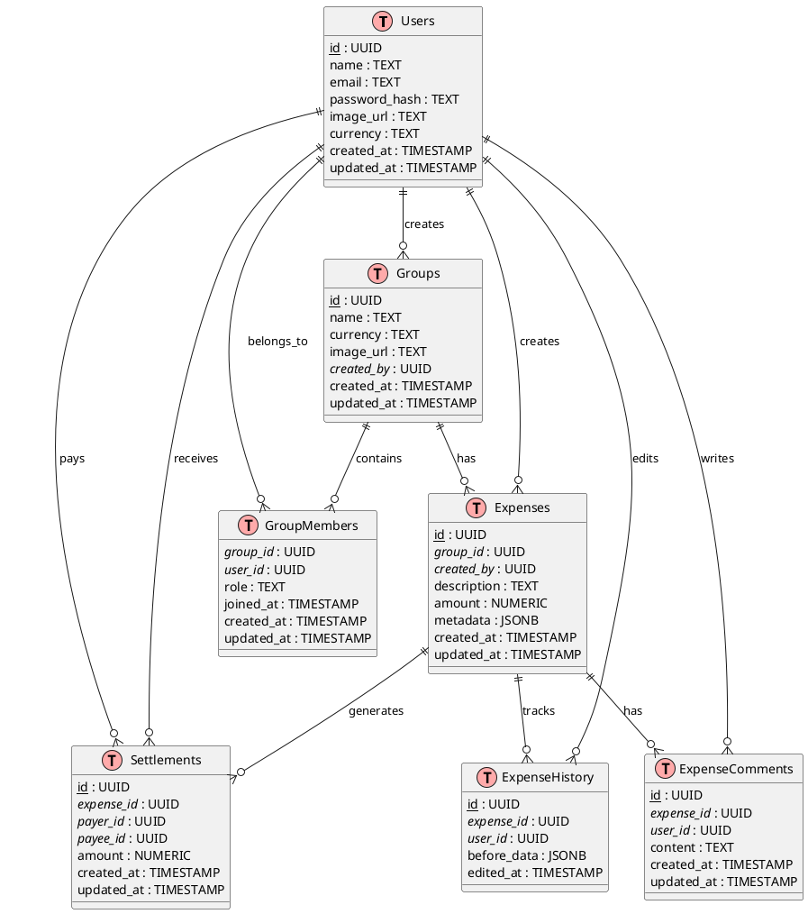

# Database Schema for Splitwiser

## Overview

This document outlines the database schema for Splitwiser, a modern expense splitting application. The schema is designed to support core functionalities including user management, group-based expense tracking, flexible expense splitting, and settlement management.

## Key Design Principles

- **UUID Primary Keys**: All tables use UUID for primary keys to ensure global uniqueness and better distributed system support
- **Audit Trail**: All tables include `created_at` and `updated_at` timestamps for tracking changes
- **Flexible Metadata**: JSONB fields are used for storing complex data structures like expense splits and tags
- **Referential Integrity**: Foreign key relationships ensure data consistency across tables

## Entity Relationship Diagram



## Table Definitions

### 1. Users

The `Users` table stores all user account information and authentication data.

| Column        | Type      | Description                                  | Constraints                    |
| ------------- | --------- | -------------------------------------------- | ------------------------------ |
| id (PK)       | UUID      | Unique user identifier                       | PRIMARY KEY, NOT NULL          |
| name          | TEXT      | User's full name                             | NOT NULL                       |
| email         | TEXT      | Unique email address for authentication     | UNIQUE, NOT NULL               |
| password_hash | TEXT      | Hashed password (using bcrypt/scrypt)        | NOT NULL                       |
| image_url     | TEXT      | Profile picture URL                          | NULL allowed                   |
| currency      | TEXT      | Preferred currency (ISO 4217 code)          | DEFAULT 'USD'                  |
| created_at    | TIMESTAMP | Account creation timestamp                   | NOT NULL, DEFAULT CURRENT_TIME |
| updated_at    | TIMESTAMP | Last profile update timestamp                | NOT NULL, DEFAULT CURRENT_TIME |

**Notes:**
- Email uniqueness is enforced to prevent duplicate accounts
- Password should be hashed using a strong algorithm (bcrypt recommended)
- Currency defaults to USD but can be customized per user

### 2. Groups

The `Groups` table represents expense sharing groups (e.g., "Roommates", "Trip to Paris").

| Column     | Type      | Description                                  | Constraints                    |
| ---------- | --------- | -------------------------------------------- | ------------------------------ |
| id (PK)    | UUID      | Unique group identifier                      | PRIMARY KEY, NOT NULL          |
| name       | TEXT      | Group name/title                             | NOT NULL                       |
| currency   | TEXT      | Default currency for group expenses         | NOT NULL, DEFAULT 'USD'        |
| image_url  | TEXT      | Group picture/avatar URL                     | NULL allowed                   |
| created_by | UUID (FK) | User who created the group                   | FOREIGN KEY → Users(id)        |
| created_at | TIMESTAMP | Group creation timestamp                     | NOT NULL, DEFAULT CURRENT_TIME |
| updated_at | TIMESTAMP | Last group update timestamp                  | NOT NULL, DEFAULT CURRENT_TIME |

**Notes:**
- Groups have a default currency that can be different from member preferences
- The creator maintains special privileges for group management
- Group currency affects how expenses are displayed and calculated

### 3. GroupMembers

Junction table managing many-to-many relationship between Users and Groups.

| Column        | Type      | Description                                  | Constraints                    |
| ------------- | --------- | -------------------------------------------- | ------------------------------ |
| group_id (FK) | UUID      | Reference to Groups table                    | FOREIGN KEY → Groups(id)       |
| user_id (FK)  | UUID      | Reference to Users table                     | FOREIGN KEY → Users(id)        |
| role          | TEXT      | Member role in group (admin/member)         | DEFAULT 'member'               |
| joined_at     | TIMESTAMP | When user joined the group                   | NOT NULL, DEFAULT CURRENT_TIME |
| created_at    | TIMESTAMP | Record creation timestamp                    | NOT NULL, DEFAULT CURRENT_TIME |
| updated_at    | TIMESTAMP | Last role/membership update                  | NOT NULL, DEFAULT CURRENT_TIME |

**Composite Primary Key:** `(group_id, user_id)`

**Notes:**
- Prevents duplicate memberships for the same user in a group
- Role determines permissions (admins can modify group settings, remove members)
- Tracks when each user joined for historical purposes

### 4. Expenses

Core table storing all expense information and splitting details.

| Column        | Type      | Description                                  | Constraints                    |
| ------------- | --------- | -------------------------------------------- | ------------------------------ |
| id (PK)       | UUID      | Unique expense identifier                    | PRIMARY KEY, NOT NULL          |
| group_id (FK) | UUID      | Group this expense belongs to                | FOREIGN KEY → Groups(id)       |
| created_by    | UUID (FK) | User who created the expense                 | FOREIGN KEY → Users(id)        |
| description   | TEXT      | Expense description (e.g., "Dinner at...")  | NOT NULL                       |
| amount        | NUMERIC   | Total expense amount                         | NOT NULL, CHECK (amount > 0)   |
| metadata      | JSONB     | Complex data: splits, tags, receipts        | NOT NULL, DEFAULT '{}'         |
| created_at    | TIMESTAMP | Expense creation timestamp                   | NOT NULL, DEFAULT CURRENT_TIME |
| updated_at    | TIMESTAMP | Last expense modification                    | NOT NULL, DEFAULT CURRENT_TIME |

**Metadata JSON Structure Example:**
```json
{
  "splits": {
    "user_id_1": {"amount": 25.50, "type": "exact"},
    "user_id_2": {"amount": 25.50, "type": "exact"}
  },
  "tags": ["food", "restaurant"],
  "receipt_urls": ["https://..."],
  "split_type": "equal|exact|percentage"
}
```

**Notes:**
- Amount validation ensures positive values only
- Metadata provides flexibility for different splitting methods
- Supports various split types: equal, exact amounts, percentages

### 5. Settlements

Tracks debt settlements between users for expense balancing.

| Column          | Type      | Description                                  | Constraints                    |
| --------------- | --------- | -------------------------------------------- | ------------------------------ |
| id (PK)         | UUID      | Unique settlement identifier                 | PRIMARY KEY, NOT NULL          |
| expense_id (FK) | UUID      | Related expense                              | FOREIGN KEY → Expenses(id)     |
| payer_id (FK)   | UUID      | User making the payment                      | FOREIGN KEY → Users(id)        |
| payee_id (FK)   | UUID      | User receiving the payment                   | FOREIGN KEY → Users(id)        |
| amount          | NUMERIC   | Settlement amount                            | NOT NULL, CHECK (amount > 0)   |
| created_at      | TIMESTAMP | Settlement record creation                   | NOT NULL, DEFAULT CURRENT_TIME |
| updated_at      | TIMESTAMP | Last settlement update                       | NOT NULL, DEFAULT CURRENT_TIME |

**Notes:**
- Represents "payer owes payee X amount" for a specific expense
- Used to calculate net balances between users
- Amount validation ensures positive settlement values
- Can be used to track both calculated debts and actual payments

### 6. ExpenseComments (Optional)

Enables users to add comments and discussions to expenses.

| Column         | Type      | Description                                  | Constraints                    |
| -------------- | --------- | -------------------------------------------- | ------------------------------ |
| id (PK)        | UUID      | Unique comment identifier                    | PRIMARY KEY, NOT NULL          |
| expense_id(FK) | UUID      | Related expense                              | FOREIGN KEY → Expenses(id)     |
| user_id (FK)   | UUID      | Comment author                               | FOREIGN KEY → Users(id)        |
| content        | TEXT      | Comment text content                         | NOT NULL                       |
| created_at     | TIMESTAMP | Comment creation timestamp                   | NOT NULL, DEFAULT CURRENT_TIME |
| updated_at     | TIMESTAMP | Last comment edit timestamp                  | NOT NULL, DEFAULT CURRENT_TIME |

**Notes:**
- Facilitates communication about specific expenses
- Supports expense clarification and dispute resolution
- Content validation should prevent empty comments

### 7. ExpenseHistory (Optional)
| Column         | Type      | Description               |
| -------------- | --------- | ------------------------- |
| id (PK)        | UUID      | Record ID                 |
| expense_id(FK) | UUID      | Linked to Expenses(id)    |
| user_id (FK)   | UUID      | Who edited                |
| before_data    | JSONB     | Snapshot of previous data |
| edited_at      | TIMESTAMP |                           |