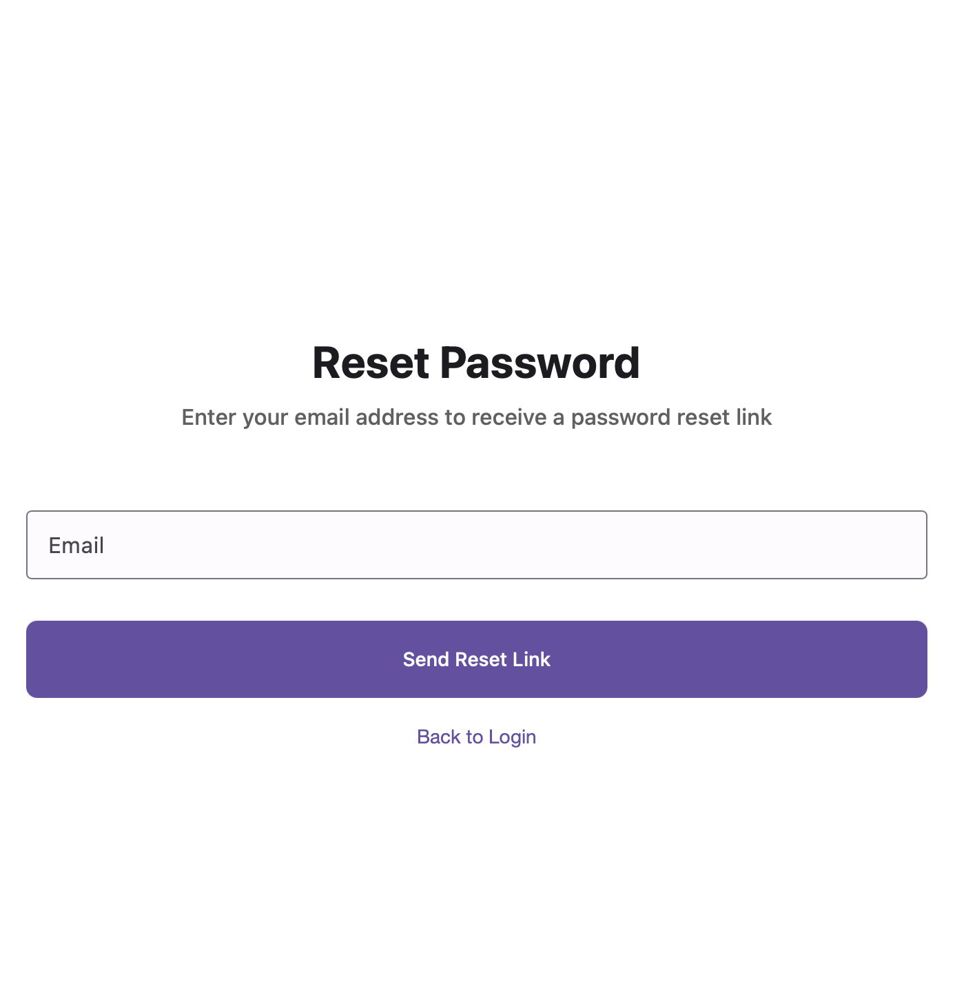

# Authentication Screens

## Login Screen

### Screen Shot


### Description
Clean login interface with email/password fields, remember me checkbox, primary login button, Google Sign-in option, and sign-up redirect link. Uses Material 3 filled text fields and elevated buttons.

### Key Features
- Material 3 filled text input fields with floating labels
- Primary button for login with appropriate elevation
- Secondary button for Google authentication
- Checkbox component for "Remember me" functionality
- Link text for navigation to sign-up screen
- Form validation with real-time error display

### Component Breakdown
- **Logo**: App branding at the top
- **Welcome Text**: Friendly greeting using `headlineMedium` typography
- **Email Field**: Filled text field with email validation
- **Password Field**: Filled text field with show/hide toggle
- **Remember Me**: Checkbox with label
- **Login Button**: Filled button with primary color
- **Google Button**: Outlined button with Google branding
- **Sign Up Link**: Text button for new users

### Interactions
- Form validation on field blur and submit
- Loading state during authentication
- Error messages for invalid credentials
- Keyboard handling and auto-focus
- Accessibility support with screen reader labels

## Sign Up Screen

### Screenshot


### Description
Registration form with email, password, and confirm password fields. Includes primary sign-up button and login redirect for existing users. Form validation shows real-time feedback for password strength and email format.

### Key Features
- Three-step form validation (email format, password strength, confirmation match)
- Real-time feedback for password requirements
- Visual indicators for form completion
- Navigation back to login screen
- Consistent styling with login screen

### Component Breakdown
- **Logo**: Same app branding as login
- **Title**: "Sign Up" using `headlineMedium` typography
- **Email Field**: Email validation with format checking
- **Password Field**: Password strength indicator
- **Confirm Password**: Match validation with first password
- **Sign Up Button**: Filled button, disabled until form is valid
- **Login Link**: Text button for existing users

### Validation Rules
- **Email**: Valid email format required
- **Password**: Minimum 8 characters, mix of letters and numbers
- **Confirm Password**: Must match password field exactly
- Real-time validation feedback with color-coded indicators

## Forgot Password Screen

### Screenshot

### Description
Password reset interface with clear instructions and email input. Includes back navigation and return to login option.

### Key Features
- Clear explanation of the reset process
- Email validation
- Success confirmation message
- Back navigation to login screen

## Onboarding Screens

### Onboarding Screen 1: Welcome


### Onboarding Screen 2: Groups
```
┌─────────────────────────────┐
│                             │
│     [Illustration]          │
│                             │
│      Create Groups          │
│                             │
│  Organize expenses by trip,  │
│  roommates, or any group.   │
│  Track who owes what.       │
│                             │
│                             │
│                             │
│                             │
│                             │
│  ○ ● ○                     │
│                             │
│    [SKIP]      [NEXT]      │
│                             │
└─────────────────────────────┘
```

### Onboarding Screen 3: Smart Splits
```
┌─────────────────────────────┐
│                             │
│     [Illustration]          │
│                             │
│       Smart Splitting       │
│                             │
│  Split equally, by shares,   │
│  percentages, or exact      │
│  amounts. We do the math.   │
│                             │
│                             │
│                             │
│                             │
│                             │
│  ○ ○ ●                     │
│                             │
│    [SKIP]   [GET STARTED]  │
│                             │
└─────────────────────────────┘
```

### Onboarding Features
- Swipeable screens with smooth transitions
- Progress indicators showing current screen
- Skip option on all screens except the first
- Engaging illustrations demonstrating key features
- Consistent button styling with Material 3 design

### Navigation Flow
1. **Welcome** → Next → Groups
2. **Groups** → Next → Smart Splits, Skip → Main App
3. **Smart Splits** → Get Started → Main App

All onboarding screens support:
- Smooth page transitions
- Skip functionality
- Back navigation
- Accessibility with proper heading structure
- Responsive design for different screen sizes
