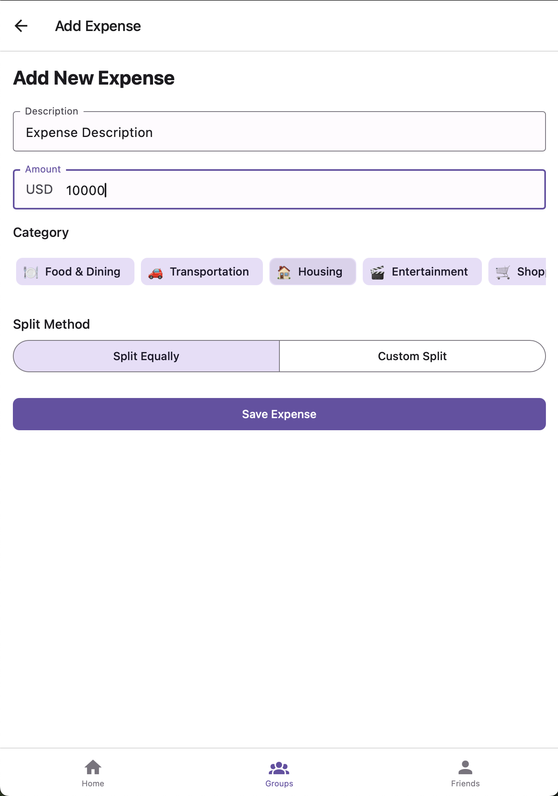

# Expense Creation Screens

## Expense Creation - Basic Details

### Screenshot

### Description
First step of expense creation focusing on basic expense details: description, amount, category, and date. Uses a clean progress indicator and validation for required fields without overwhelming step numbers.

### Key Features
- Progress indicator showing current position with visual dots
- Description field with placeholder text
- Amount input with currency formatting
- Category dropdown with emoji icons
- Date picker with smart defaults (today)
- Form validation with real-time feedback

### Component Breakdown

#### Progress Indicator
- **Progress Dots**: Filled dot for current, empty for remaining steps
- **Visual Feedback**: Clean indication of multi-step process without numbers
- **Minimal Design**: Simple dot pattern for progress tracking

#### Form Fields
- **Description**: Text input with helpful placeholder
- **Amount**: Numeric input with currency symbol and formatting
- **Category**: Dropdown with predefined expense categories
- **Date**: Date picker with calendar interface

#### Categories
- 🍽️ Food & Dining
- 🚗 Transportation
- 🏠 Housing
- 🎬 Entertainment
- 🛒 Shopping
- 💊 Healthcare
- ✈️ Travel
- 📱 Utilities
- 🎓 Education
- 💼 Business
- 🎁 Gifts
- 🔧 Other

### Interactions
- Real-time amount formatting with currency symbol
- Category selection with searchable dropdown
- Date picker with calendar view and quick presets
- Form validation preventing progression with incomplete data

## Expense Creation - Select Payers

### Wireframe Sketch
```
┌─────────────────────────────┐
│ ← Add Expense        [✓]    │
│─────────────────────────────│
│                             │
│ ●●○○                        │
│                             │
│ Who paid for this?          │
│                             │
│ ○ Single payer              │
│ ● Multiple payers           │
│                             │
│ Select payers:              │
│                             │
│ ┌─────────────────────┐     │
│ │ ☑️ You        $45.00 │     │
│ │ [_____________]      │     │
│ └─────────────────────┘     │
│                             │
│ ┌─────────────────────┐     │
│ │ ☑️ Alex       $40.50 │     │
│ │ [_____________]      │     │
│ └─────────────────────┘     │
│                             │
│ ┌─────────────────────┐     │
│ │ ☐ Sam        $0.00  │     │
│ │ [_____________]      │     │
│ └─────────────────────┘     │
│                             │
│ Total paid: $85.50          │
│                             │
│ ┌─────────────────────┐     │
│ │       NEXT          │     │
│ └─────────────────────┘     │
│                             │
└─────────────────────────────┘
```

### Description
Second step allowing selection of who paid for the expense. Supports both single and multiple payers with amount specification for each payer. Progress shown with clean dot indicators.

### Key Features
- Radio buttons for single vs multiple payers
- Member checkboxes with individual amount inputs
- Real-time total calculation and validation
- Smart amount distribution when switching modes
- Clear visual feedback for selected payers

### Component Breakdown

#### Payment Mode Selection
- **Single Payer**: Traditional one-person payment
- **Multiple Payers**: Split payment between multiple people
- **Mode Toggle**: Radio buttons with automatic amount adjustment

#### Payer Selection
- **Member List**: All group members with checkboxes
- **Amount Inputs**: Individual payment amounts for each payer
- **Total Validation**: Ensures paid amounts match expense total
- **Smart Distribution**: Auto-calculate amounts when toggling modes

#### Validation
- **Total Match**: Paid amounts must equal expense total
- **Positive Amounts**: All individual amounts must be positive
- **At Least One**: Minimum one payer must be selected

### Interactions
- Toggle between single/multiple payer modes
- Check/uncheck members with automatic amount calculations
- Manual amount adjustment with real-time total updates
- Visual indicators for validation errors

## Expense Creation - Split Method

### Wireframe Sketch
```
┌─────────────────────────────┐
│ ← Add Expense        [✓]    │
│─────────────────────────────│
│                             │
│ ●●●○                        │
│                             │
│ How should this be split?   │
│                             │
│ ○ Equal split               │
│ ● Custom amounts            │
│ ○ Percentage split          │
│ ○ By shares                 │
│                             │
│ Split details:              │
│                             │
│ ┌─────────────────────┐     │
│ │ 👤 You       $30.00 │     │
│ │ [_____________]      │     │
│ └─────────────────────┘     │
│                             │
│ ┌─────────────────────┐     │
│ │ 👤 Alex      $25.50 │     │
│ │ [_____________]      │     │
│ └─────────────────────┘     │
│                             │
│ ┌─────────────────────┐     │
│ │ 👤 Sam       $30.00 │     │
│ │ [_____________]      │     │
│ └─────────────────────┘     │
│                             │
│ Total: $85.50               │
│                             │
│ ┌─────────────────────┐     │
│ │       NEXT          │     │
│ └─────────────────────┘     │
│                             │
└─────────────────────────────┘
```

### Description
Third step for defining how the expense should be split among participants. Offers multiple split methods with real-time calculation and validation. Progress shown with clean visual indicators.

### Key Features
- Four split methods: equal, custom amounts, percentage, shares
- Dynamic UI based on selected split method
- Real-time calculation and validation
- Member inclusion/exclusion options
- Clear visual feedback for split amounts

### Component Breakdown

#### Split Methods
- **Equal Split**: Divide total amount equally among selected members
- **Custom Amounts**: Manually specify exact amounts for each person
- **Percentage Split**: Define percentage share for each member
- **By Shares**: Assign shares/units to each member for proportional split

#### Split Interface (varies by method)
- **Equal**: Simple member selection with auto-calculated amounts
- **Custom**: Individual amount inputs with total validation
- **Percentage**: Percentage inputs with 100% total requirement
- **Shares**: Share count inputs with proportional calculation

#### Member Selection
- **Include/Exclude**: Toggle members in/out of the split
- **Visual Indicators**: Clear distinction between included/excluded members
- **Smart Defaults**: Include all group members by default

### Interactions
- Switch between split methods with automatic recalculation
- Include/exclude members from the split
- Real-time validation and error feedback
- Auto-calculation based on selected method

## Expense Creation - Review & Submit

### Wireframe Sketch
```
┌─────────────────────────────┐
│ ← Add Expense        [✓]    │
│─────────────────────────────│
│                             │
│ ●●●●                        │
│                             │
│ Review your expense         │
│                             │
│ ┌─────────────────────┐     │
│ │ 🍽️ Dinner at restaurant │
│ │ $85.50 • Today      │     │
│ │                     │     │
│ │ Paid by:            │     │
│ │ • You: $45.00       │     │
│ │ • Alex: $40.50      │     │
│ │                     │     │
│ │ Split between:      │     │
│ │ • You: $30.00       │     │
│ │ • Alex: $25.50      │     │
│ │ • Sam: $30.00       │     │
│ └─────────────────────┘     │
│                             │
│ Net amounts:                │
│ ┌─────────────────────┐     │
│ │ You lent: $15.00    │     │
│ │ Alex owes: $14.00   │     │
│ │ Sam owes: $30.00    │     │
│ └─────────────────────┘     │
│                             │
│ ┌─────────────────────┐     │
│ │   CREATE EXPENSE    │     │
│ └─────────────────────┘     │
│                             │
└─────────────────────────────┘
```

### Description
Final review step showing complete expense summary with payment details, split breakdown, and net amounts for each member. All progress dots filled to indicate completion.

### Key Features
- Complete expense summary in card format
- Payment breakdown showing who paid what
- Split details showing each person's share
- Net amount calculation (what each person owes/is owed)
- Final create button with loading state
- Option to go back and edit any step

### Component Breakdown

#### Expense Summary Card
- **Description**: Expense title with category emoji
- **Amount & Date**: Total amount and date stamp
- **Visual Design**: Elevated card with clear information hierarchy

#### Payment Details
- **Payers List**: Who paid and how much
- **Multiple Payer Support**: Clear breakdown for complex payments
- **Visual Distinction**: Different styling for payers vs split participants

#### Split Breakdown
- **Participant List**: Each person's share of the expense
- **Split Method**: Indication of how split was calculated
- **Total Validation**: Confirmation that splits add up correctly

#### Net Amounts
- **Balance Changes**: What each person owes or is owed
- **Color Coding**: Green for amounts owed to user, red for amounts user owes
- **Summary Format**: Clear, scannable format for quick review

### Interactions
- Tap any section to go back and edit
- Create expense with loading state and success feedback
- Error handling for network issues
- Success navigation to group details with new expense highlighted

## Receipt Upload (Optional Feature)

### Wireframe Sketch
```
┌─────────────────────────────┐
│ ← Add Receipt               │
│─────────────────────────────│
│                             │
│ Add Receipt (Optional)      │
│                             │
│ ┌─────────────────────┐     │
│ │                     │     │
│ │   📷 TAKE PHOTO     │     │
│ │                     │     │
│ └─────────────────────┘     │
│                             │
│ ┌─────────────────────┐     │
│ │                     │     │
│ │ 📁 CHOOSE FROM      │     │
│ │    GALLERY          │     │
│ │                     │     │
│ └─────────────────────┘     │
│                             │
│ ┌─────────────────────┐     │
│ │ [Receipt Preview]   │     │
│ │                     │     │
│ │  ┌─────────────┐    │     │
│ │  │   Receipt   │    │     │
│ │  │   Image     │    │     │
│ │  └─────────────┘    │     │
│ │                     │     │
│ │ [🗑️]        [✓]     │     │
│ └─────────────────────┘     │
│                             │
│ ┌─────────────────────┐     │
│ │       DONE          │     │
│ └─────────────────────┘     │
│                             │
└─────────────────────────────┘
```

### Description
Optional receipt attachment feature that can be accessed from any step of expense creation. Supports camera capture and gallery selection with preview functionality.

### Key Features
- Camera integration for instant receipt capture
- Gallery selection for existing photos
- Image preview with crop/rotate options
- OCR integration for automatic amount detection
- Optional attachment (can skip)

### Component Breakdown

#### Capture Options
- **Camera Button**: Direct camera access for new photos
- **Gallery Button**: Select from existing device photos
- **Permission Handling**: Appropriate camera/storage permissions

#### Image Processing
- **Preview Screen**: Show captured/selected image
- **Edit Tools**: Crop, rotate, brightness adjustment
- **OCR Integration**: Automatic amount and merchant detection
- **Compression**: Optimize image size for storage

### Interactions
- Camera interface with standard photo capture
- Gallery picker with multi-select option
- Image editing with intuitive gestures
- OCR results review and correction
- Easy removal/replacement of receipt images
