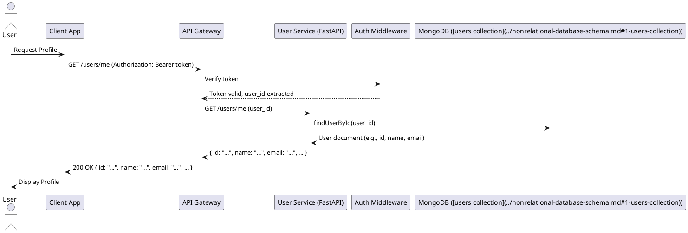
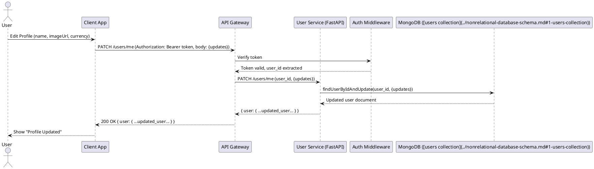
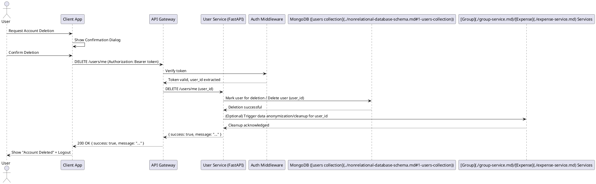

# User Service API Documentation

## Overview

The User Service is responsible for managing user-specific data within the Splitwiser application. This includes retrieving user profiles, updating preferences, and handling account deletion. It works in conjunction with the [Auth Service](./auth-service.md), which manages authentication and identity.

## API Endpoint Summary

| Method | Endpoint         | Description                          |
|--------|------------------|--------------------------------------|
| GET    | [`/users/me`](#1-get-current-user-profile)      | Get current user profile             |
| PATCH  | [`/users/me`](#2-update-user-profile--preferences) | Update profile & preferences         |
| DELETE | [`/users/me`](#3-delete-own-account)        | Delete own account                   |

## Key Features

- **User Profile Management**: Allows users to view and update their personal information.
- **Preference Settings**: Enables users to customize their experience (e.g., default currency).
- **Account Deletion**: Provides a secure way for users to delete their accounts.

## API Endpoints

All endpoints require a valid `Authorization: Bearer <access_token>` header.

### 1. Get Current User Profile

Retrieves the profile information for the currently authenticated user.

- **Endpoint**: `GET /users/me`
- **Authorization**: `Bearer <access_token>`

**Successful Response (200 OK):**

```json
{
  "id": "usr_123abc",
  "name": "Jane Doe",
  "email": "jane.doe@example.com",
  "image_url": "https://example.com/profile.jpg",
  "currency": "USD",
  "created_at": "2024-01-15T10:00:00Z",
  "updated_at": "2024-01-16T12:30:00Z"
}
```

**PlantUML Diagram:**



### 2. Update User Profile & Preferences

Allows the currently authenticated user to update their profile information and preferences.

- **Endpoint**: `PATCH /users/me`
- **Authorization**: `Bearer <access_token>`
- **Request Body**:

  ```json
  {
    "name": "Johnathan Doe",
    "imageUrl": "https://example.com/profiles/johnathan_doe_new.jpg",
    "currency": "EUR"
  }
  ```
  *All fields are optional. Only provided fields will be updated.*

**Successful Response (200 OK):**

```json
{
  "user": {
    "id": "507f191e810c19729de860ea",
    "name": "Johnathan Doe",
    "email": "john.doe@example.com",
    "image_url": "https://example.com/profiles/johnathan_doe_new.jpg",
    "currency": "EUR",
    "created_at": "2024-01-10T10:00:00Z",
    "updated_at": "2025-06-11T10:15:00Z"
  }
}
```

**PlantUML Diagram:**



### 3. Delete Own Account

Allows the currently authenticated user to delete their account. This is a critical operation and should involve a confirmation step on the client-side.

- **Endpoint**: `DELETE /users/me`
- **Authorization**: `Bearer <access_token>`

**Successful Response (200 OK):**

```json
{
  "success": true,
  "message": "User account scheduled for deletion."
}
```
*(Note: Actual deletion might be a soft delete or a background process. The message can reflect this.)*

**Considerations for Deletion:**
- **Data Anonymization/Deletion**: Decide on a strategy for user-related data in other services (e.g., expenses, groups). Anonymize or delete as per application policy.
- **Grace Period**: Consider a grace period before permanent deletion, allowing users to recover their account.
- **Impact on Shared Data**: Inform users about what happens to groups or expenses they created or participated in.

**PlantUML Diagram:**



## Data Models Alignment

The User Service primarily interacts with the [`users` collection](../nonrelational-database-schema.md#1-users-collection) in MongoDB.

**[`users` Collection (from `nonrelational-database-schema.md`](../nonrelational-database-schema.md#1-users-collection)):**
```javascript
{
  _id: ObjectId,
  name: String,              // User's full name
  email: String,             // Unique email address (indexed)
  passwordHash: String,      // Hashed password (managed by Auth Service)
  imageUrl: String,          // Profile picture URL (optional)
  currency: String,          // Preferred currency (ISO 4217, default: "USD")
  createdAt: Date,
  updatedAt: Date            // Last profile update timestamp
}
```

- `GET /users/me` reads from this collection, omitting `passwordHash`.
- `PATCH /users/me` updates permissible fields (`name`, `imageUrl`, `currency`) and `updatedAt`.
- `DELETE /users/me` marks the document for deletion or removes it, potentially triggering actions on related data from other services like [Group Service](./group-service.md) or [Expense Service](./expense-service.md).

## Error Handling

Standard HTTP error codes will be used:

- **400 Bad Request**: Invalid request payload (e.g., invalid currency code).
  ```json
  {
    "error": "InvalidInput",
    "message": "Validation failed.",
    "details": {
      "currency": "Must be a valid ISO 4217 currency code."
    }
  }
  ```
- **401 Unauthorized**: Invalid or missing access token.
  ```json
  {
    "error": "Unauthorized",
    "message": "Authentication token is missing or invalid."
  }
  ```
- **404 Not Found**: User not found (should generally not happen for `/users/me` if token is valid, but good practice).
- **500 Internal Server Error**: Unexpected server-side error.

## Rate Limiting

- **`GET /users/me`**: 60 requests/minute per user.
- **`PATCH /users/me`**: 20 requests/minute per user.
- **`DELETE /users/me`**: 5 requests/hour per user (to prevent abuse).

## Caching Strategy

- **User Profile Data (`GET /users/me`)**:
  - Can be cached client-side.
  - Server-side caching can be employed (e.g., Redis) with a short TTL (e.g., 1-5 minutes) or invalidated upon `PATCH /users/me`.
  - `ETag` headers can be used for conditional requests to save bandwidth.
